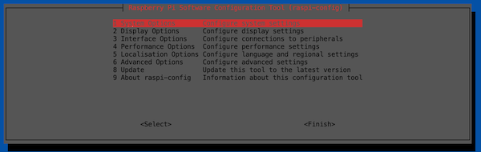

# TL:DR for Configuring Network Interfaces on Raspberry Pi 
Every time I work with a new Linux distribution it seems I need to learn a new way to manage network interface configuration.  The Raspberry Pi is no different in this case.  This page is mostly as a reminder/pointer for the key parts of network configuration on RPis and not intended to be comprehensive.  For the comprehensive details on network configuration for a Raspberry Pi, check out the [official documentation](https://www.raspberrypi.com/documentation/computers/configuration.html#configuring-networking). 

> Note: There are MANY versions of Raspberry Pis, and not all have the same physical network interfaces included.  Be sure to keep your individual RPi in mind when reviewing this document. 

## Use `rasp-config` 
The simplest way to setup wireless on a RPi is to use the `rasp-config` CLI utility.  Under the "1 System Options", you'll find "S1 Wireless LAN".  This will walk you through connecting to a wireless network.



## Configuring Wireless Manually 
The RPi uses the relatively common utility "wpa-supplicant" for managing wireless networks.  You can manually configure the wireless network to join by editing the file `/etc/wpa_supplicant/wpa_supplicant.conf`

```
network={
        ssid="Your Awesome SSID"
        psk=psk=e8c5342ce8bb79c9693ae9ec805a00b60500915d338021202a8c7df76d105dd7
}
```

The `psk` value above is an encrypted value for the passphrase.  This is easily created by using the `wpa_passphrase` utility.  It even provides the configuration to place into the file for the SSID. 

```bash
wpa_passphrase "Your Awesome SSID" "YourAwesomePassphrase"

# Output 
network={
        ssid="Your Awesome SSID"
        #psk="YourAwesomePassphrase"
        psk=e8c5342ce8bb79c9693ae9ec805a00b60500915d338021202a8c7df76d105dd7
}
```

> Note: You can also add the `psk` in clear text.  That isn't recommended... 

## Configuring Static IPs using the DHCP Client Configuration
The RPi defaults to having a DHCP Client running.  The simplest way to configure static IP addresses is by adding it to the `/etc/dhcpcd.conf` file.  

> The DHCP client is `dhcpcd` - details can be found with `man dhcpcd`

Within the default `dhcpcd.conf` file you will find examples of how to configure a static ip address for an interface.  

In the example below I am configuring a static IP address for the `eth0` interface on my Rpi.  

> This is the wired network interface I connect into my lab network.  The wireless network connects to my home network and it allows me to connect to the Rpi with SSH. 

```bash
# Home Network Lab Setup
interface eth0
static ip_address=192.168.192.12/24
static routers=192.168.192.1

# I am running DNS on another RPi in my lab
static domain_name_servers=192.168.192.11

# By default ethernet interfaces are given a metric 
# 200 + interface index. This would make the eth0 
# routes preferred over wlan0. But I need wlan0 to
# be preferred to allow internet access. So I set 
# the metric for the eth0 interface to 500
metric 500

# If you want IPv6 address
# static ip6_address=fd51:42f8:caae:d92e::ff/64
```

## Configuring Static Routes 
Use the `ip route` command to add new static routes on a RPi just like any other Linux system. 

```bash
# Add route to 192.168.0.0/16 network through 192.168.192.1 on eth0
sudo ip route add 192.168.0.0/16 via 192.168.192.1 dev eth0
```

If you want to make the route persistent across reboots, add the command to the file `/etc/dhcpcd.exit-hook` which is called as part of the DHCP Client operation. 

```
cat /etc/dhcpcd.exit-hook 

# Output
ip route add 192.168.0.0/16 via 192.168.192.1 dev eth0
```

> Note: The file `/etc/dhcpcd.exit-hook` isn't created by default.  Just create it and add commands needed. 